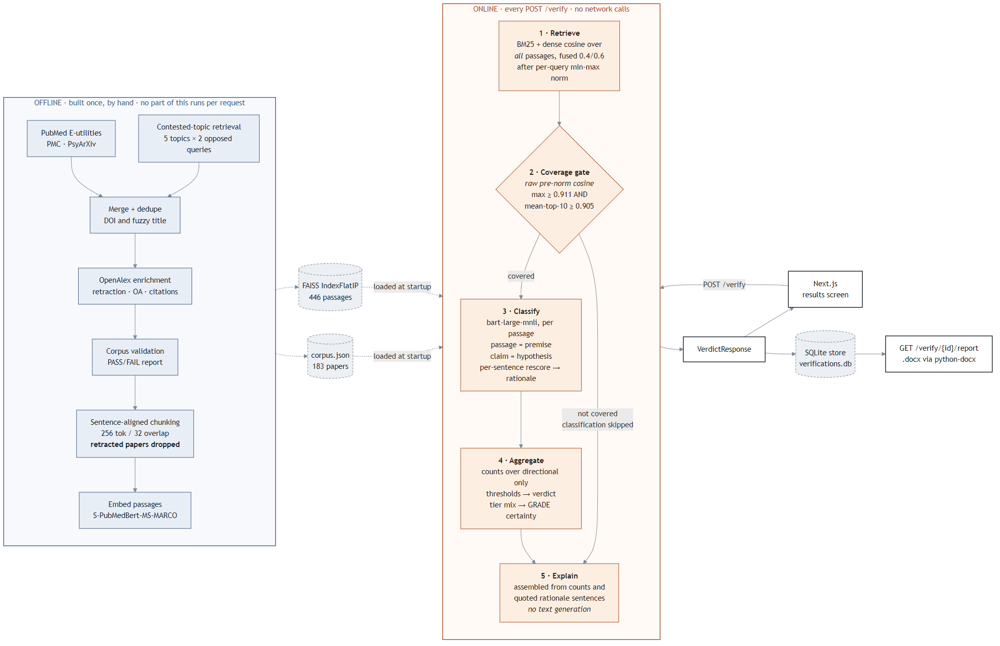
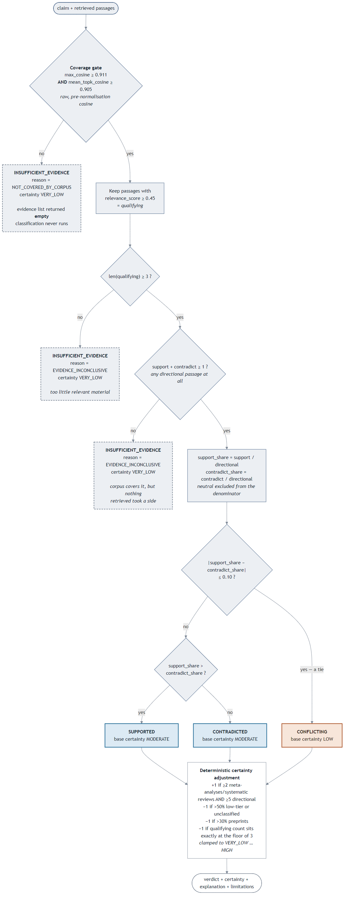

# EvidenceAI — Final Report

An explainable research-claim verification system for mental health literature.

- [1. Problem and scope](#1-problem-and-scope)
- [2. Corpus construction](#2-corpus-construction)
- [3. Methodology](#3-methodology)
- [4. The coverage gate](#4-the-coverage-gate)
- [5. The fine-tuning experiment](#5-the-fine-tuning-experiment)
- [6. Explanation faithfulness](#6-explanation-faithfulness)
- [7. Performance engineering](#7-performance-engineering)
- [8. Evaluation](#8-evaluation)
- [9. Limitations](#9-limitations)
- [10. Future work](#10-future-work)

---

## 1. Problem and scope

A researcher, student or journalist encountering a claim — "mindfulness-based
interventions reduce ADHD symptoms" — wants to know what the published
literature says about it. Answering properly means finding the relevant papers,
reading them for whether they support or undercut the claim, noticing where
they disagree, and weighing how good the underlying studies are.

EvidenceAI automates a first pass at that. A user submits a claim; the system
retrieves passages from a fixed corpus of mental health research, classifies
each as supporting, contradicting or neutral, aggregates those into a verdict
with a certainty rating, and explains the result with the evidence attached.

**It is a literature triage aid, not a diagnostic tool and not treatment
advice.** That scope is not a disclaimer bolted on at the end — it shapes the
design. Verdicts are phrased as statements about retrieved evidence ("the
evidence supports this claim"), never as recommendations ("you should do X").
The scope statement is pinned to the top of the results screen and sits
directly under the header of every exported report, ahead of the verdict,
because a caveat that arrives after the conclusion has already formed is not
doing its job.

Two design commitments follow from taking the scope seriously, and they run
through everything below:

1. **The system must be able to say it does not know.** A verifier that always
   returns a verdict is worse than useless on claims outside its competence,
   because a confident wrong answer is more damaging than no answer.
2. **Every claim the system makes about its own reasoning must be checkable.**
   Explanations are assembled from computed values and quoted source text, not
   generated.

---

## 2. Corpus construction

183 papers, indexed as 446 passages, drawn from PubMed E-utilities (118), PMC
(59) and PsyArXiv (7), published 2014–2026. Validated by
`app/ingestion/validate_corpus.py`; full report at
[`eval/results/corpus_validation.txt`](../eval/results/corpus_validation.txt).

| Property | Value |
|---|---|
| Papers | 183 |
| Indexed passages | 446 |
| Peer-reviewed / preprint | 176 (96%) / 7 (4%) |
| Missing abstract, authors, or year | 0 |
| Abstract length (median / mean) | 1,957 / 2,094 chars |
| Retraction-checked against OpenAlex | 178 / 183 |
| Flagged retracted | 0 |
| Duplicate titles (fuzzy ≥ 90%) | none |

**Study design mix.** RCT 37, other 37, meta-analysis 21, cross-sectional 13,
systematic review 5, cohort 4, case report 1 — and **65 unclassified**. That
last number matters: a third of the corpus carries no verified design tier,
which is why the certainty rules treat a weak tier signal as the normal case
rather than an exception.

**Topic coverage** (keyword-based, papers may count in several): depression 78,
anxiety 54, digital mental health 32, sleep 25, social media 23, mindfulness 19,
exercise 19, ADHD 18, CBT 9.

### The contested-topic strategy

A corpus assembled by topic search has a systematic bias: it returns whatever
the search ranked highest, which skews toward papers reporting effects.
Verifying a claim against such a corpus produces agreement by construction, and
`CONFLICTING` becomes a verdict the system can emit but never will.

So five genuinely contested claims were selected — questions where the field's
disagreement is documented and substantive:

| Topic | The disagreement | Papers |
|---|---|---|
| `ssri_mild_depression_efficacy` | Effect size below clinical significance in mild-to-moderate depression (Kirsch; Fournier) vs. statistically superior across severities (Cipriani) | 14 |
| `social_media_adolescent_mental_health` | Substantial contributor to teen mental illness (Twenge, Haidt) vs. tiny effect sizes and unestablished causality (Orben & Przybylski, Odgers) | 16 |
| `psychological_debriefing_ptsd_prevention` | Widely adopted on theory vs. Cochrane reviews finding no benefit and some evidence of harm (Mayou) | 14 |
| `cannabis_psychosis_risk` | Dose-response in longitudinal cohorts vs. reverse causation and unmeasured confounding | 15 |
| `mindfulness_adhd_symptoms` | Positive RCTs and meta-analyses vs. null results against active controls, with bias concerns in the positive studies | 15 |

Each was queried **twice** against the same population and intervention: once
with terms oriented toward a positive effect, once toward null findings. That
is a retrieval strategy, not a labelling one — papers are tagged with
`contested_topic` but never with an assumed side, because assigning a side at
ingestion time would be pre-writing the answer the classifier is supposed to
produce. 74 of the 183 papers came in this way.

---

## 3. Methodology



Full design rationale is in [`architecture.md`](architecture.md). In summary:

**Offline (once, by hand):** scrape → merge and dedupe on DOI and fuzzy title →
enrich from OpenAlex (retraction, open access, citations) → validate → chunk on
sentence boundaries at 256 tokens with 32 overlap, dropping retracted papers →
embed with `pritamdeka/S-PubMedBert-MS-MARCO` → FAISS `IndexFlatIP`.

**Online (every request, no network calls):**

1. **Retrieve.** BM25 Okapi and dense cosine, each scored over *all* passages, min-max normalised per query and fused 0.4 / 0.6. Top 10 kept; passages below a fused 0.45 discarded.
2. **Gate.** Raw pre-normalisation cosine against calibrated floors — see §4.
3. **Classify.** `bart-large-mnli` per passage as an NLI problem: passage is the premise, claim is the hypothesis, entailment/contradiction/neutral map onto support/contradict/neutral. Each sentence is then rescored alone; the highest scorer for the assigned label becomes the rationale.
4. **Aggregate.** Shares over directional evidence only; thresholds produce the verdict; the tier mix adjusts certainty.
5. **Explain.** Assembled from the values above.



Verdict logic is fully deterministic and shown above in full. Three distinct
routes reach `INSUFFICIENT_EVIDENCE`, and the system distinguishes them because
"the corpus cannot speak to this" and "the evidence has no direction" are
different findings that a reader would act on differently.

---

## 4. The coverage gate

### The bug

`MIN_SIMILARITY` thresholded a **per-query min-max normalised** score. That
normalisation sets the top-ranked passage of every query to 1.0 — including a
query about nothing in the corpus. The threshold therefore answered "is this
the best of what we found?" and structurally could not answer "is any of this
relevant?".

The consequence was not subtle. *"Eating chocolate cake improves stock market
forecasting"* returned a confident **CONTRADICTED**. So did *"left-handed
pigeons navigate using prime numbers"* and *"Roman concrete achieves
self-healing durability through lime clasts"*. Nine off-corpus claims out of 20
received confident directional verdicts.

### The fix

Ranking and gating were separated onto different signals. Raw, pre-normalisation
cosine is bounded and therefore comparable across queries, so it can carry an
absolute floor; the fused ranking score cannot. `CoverageSignals` carries
`max_cosine`, `mean_topk_cosine` and `top_bm25` through untouched.

Thresholds were **calibrated, not guessed** — the useful range of raw cosine is
a property of the embedding model and this corpus, so it had to be measured. 20
in-domain claims were scored against 20 off-corpus ones in three difficulty
classes: other scientific domains (7), nonsense (6), and **near-miss** (7) —
real biomedical claims a mental health corpus still cannot answer, such as
statin mortality trials or ICU mobilisation.

Results: `MIN_MAX_COSINE = 0.911`, `MIN_MEAN_TOPK_COSINE = 0.905`. End to end,
20 of 40 verdicts changed, **all 20 of them off-corpus claims, with no in-domain
verdict altered**. The nine confident-but-wrong directional verdicts went to
zero.

### What it does not fix

Reported plainly because the margin is thin:

- **`mean_topk_cosine` separates the two sets by 0.006.** Real, but very close to touching.
- **`max_cosine` does not separate them at all** — the highest off-corpus value (0.926) exceeds the lowest in-domain one (0.916). It is set below the lowest in-domain observation as a safety net rather than tuned up at the cost of rejecting valid claims.
- **The headline 20/20 and 0/20 are training-set fit**, since the thresholds were chosen on those same claims. Recalibrating on half and scoring the held-out half gives **9/9 off-corpus caught but 4/10 in-domain wrongly rejected**. At 40 claims that is indicative only, and it is the number to trust.

The asymmetry drives the policy: an off-corpus claim slipping through produces
a wrong verdict, while rejecting an in-domain claim only refuses a question the
corpus could have answered. The second is the better failure, so floors sit
below the lowest observed in-domain value rather than at the midpoint of the
gap. Near-miss claims are where this will break first.

Rebuilding the index or changing `EMBEDDING_MODEL` invalidates the thresholds.
Full method and data: [`eval/results/similarity_calibration.md`](../eval/results/similarity_calibration.md).

---

## 5. The fine-tuning experiment

This section reports a hypothesis that was tested twice and refuted. The
negative result is the finding.

### 5.1 Hypothesis

The zero-shot baseline, `facebook/bart-large-mnli`, has a specific and
consequential weakness: on the 129-example held-out split it reaches **52.9%
recall on CONTRADICT**. For a claim-verification system, contradicting evidence
is the most valuable class — a system that misses papers undercutting a claim
will systematically over-report support.

The hypothesis was straightforward: *`bart-large-mnli` is doing generic NLI, not
scientific claim verification. Fine-tuning a strong encoder on SciFact — a
dataset built specifically for scientific claim verification, with
sentence-level rationale annotations — should teach the task properly and
improve CONTRADICT recall.*

### 5.2 Method

**Data.** [SciFact](https://huggingface.co/datasets/allenai/scifact), prepared
by `notebooks/prepare_scifact.py`. SciFact's official `test` split carries no
evidence annotations (verified live: 0/300 rows have a label or even a
citation), so evaluation used a stratified 10% split carved out of `train.jsonl`
at seed 42 — 1,158 training rows and a 129-example held-out test set. Class
distribution across train+validation (1,739 triples): SUPPORT 47.8%,
CONTRADICT 26.6%, NEUTRAL 25.5%.

**Model.** `microsoft/deberta-v3-base` with a 3-way head labelled
SUPPORT / CONTRADICT / NEUTRAL, matched by name at load time.

**Training** (`notebooks/train_stance.ipynb`, free Colab T4): fp16, batch 16
with gradient accumulation 2, 4 epochs, LR 2e-5, warmup ratio 0.1, sentence-pair
tokenization truncated at 256 tokens on the passage side, `WEIGHTING_MODE` off.
Best checkpoint selected on **macro F1** — not accuracy, which the majority
classes dominate, and not a single class's recall, which can improve at the
others' expense.

Training required the T4. A 4 GB laptop GPU OOMs on this fine-tune even with
gradient checkpointing and frozen embeddings: DeBERTa-v3's 128,100-token
vocabulary makes the embedding matrix alone cost 393 MB of gradient plus 786 MB
of AdamW state.

### 5.3 Run 1 — a large apparent win, and one impossible number

Measured by `app/pipeline/compare_classifiers.py` on the held-out 129:

| Metric | Baseline | Fine-tuned (run 1) | |
|---|---|---|---|
| Accuracy | 50.4% | **71.3%** | ▲ 20.9 |
| Macro F1 | 0.507 | **0.692** | ▲ 0.185 |
| **CONTRADICT recall** | **52.9%** | **29.4%** | ▼ **23.5** |

Accuracy and macro F1 moved enormously. The metric the experiment existed to
improve moved the wrong way, and badly.

And one number was not believable: **NEUTRAL scored 1.000 precision and 1.000
recall.** Perfect performance on a class in a noisy 3-way task, from 1,158
training rows, is not a result. It is a symptom.

### 5.4 The leak

The cause was in the data preparation, in `build_triples`.

SUPPORT and CONTRADICT rows were built from SciFact's **annotated rationale
sentences** — the specific sentences a human marked as evidence. NEUTRAL rows
had no such annotation (the claim was never annotated against that document),
so they were given the **entire abstract**.

Passage length therefore encoded the label:

| Class | Median passage length |
|---|---|
| SUPPORT / CONTRADICT | ~200 chars |
| NEUTRAL | **1,158 chars** |

Measured directly: **a single length threshold predicted NEUTRAL at 99.0%
accuracy, against a 74.5% majority-class floor.** The model had not learned
stance. It had learned *long passage = NEUTRAL*, which was free and nearly
perfect, and macro F1 was inflated by a costless 1.000 component.

The leak also explains the shape of the failure. With NEUTRAL trivially
separable, the model's remaining capacity went to a two-way SUPPORT/CONTRADICT
split it had no reliable signal for — and it collapsed toward the majority
class, which is exactly the CONTRADICT regression observed.

### 5.5 The fix

NEUTRAL passages are now a **contiguous span sampled from the cited abstract**,
with span length drawn from the *empirical rationale-length pool* rather than a
hand-picked constant, so NEUTRAL inherits the real length distribution of the
labelled classes (85% single-sentence). The span RNG is seeded off `--seed` for
reproducibility.

The fix cannot introduce label noise: the claim was never annotated as supported
or contradicted by that document, and the full abstract strictly contained every
span now drawn — so any span carries no more stance than the whole did.

Measured after the fix: **74.5% separability — exactly the majority-class
floor.** Passage length now carries no information about the label.
`report_length_leak()` re-measures this on every prep run and prints a warning
if length regains predictive power above the floor, so the same mistake cannot
return silently. Triple counts and class balance were unchanged, so the held-out
split indices remained valid.

### 5.6 Run 2 — the leak closes, the hypothesis still fails

Retrained on the corrected data, same configuration:

| Metric | Baseline | Fine-tuned (run 2) | |
|---|---|---|---|
| Accuracy | 51.9% | 58.9% | ▲ 7.0 |
| Macro F1 | **0.521** | 0.518 | ▼ 0.003 |
| **CONTRADICT recall** | **52.9%** | **17.6%** | ▼ **35.3** |
| SUPPORT recall | 29.0% | 82.3% | ▲ 53.3 |
| NEUTRAL P / R | 0.392 / 0.939 | 0.655 / 0.576 | — |
| Inference / passage | 36.4 ms | 26.1 ms | — |

*(Baseline figures shift slightly from run 1 — 50.4% → 51.9% — because the leak
fix rewrote the NEUTRAL passages, so the zero-shot model is scored on different
text for a third of the split. The split indices are unchanged.)*

Two things happened, and they must be read separately.

**The fix worked.** NEUTRAL fell from a fabricated 1.000/1.000 to a real
0.655/0.576. The model is no longer riding passage length.

**The hypothesis still failed.** CONTRADICT recall did not recover — it fell
further, to **17.6%**. The confusion matrix shows it directly: of 34 CONTRADICT
examples, **25 were predicted SUPPORT**. The model predicts SUPPORT for 89 of
129 examples (69%) when SUPPORT is only 48% of the set. It is not distinguishing
the *direction* of evidence at all; it has learned to detect topical relevance
and default to agreement.

Macro F1 ties the baseline (0.518 vs 0.521). The 7 accuracy points come entirely
from SUPPORT recall, the class that was already easiest.

### 5.7 Conclusion

**The hypothesis is refuted across two runs on the same data, one leaked and one
clean.** Fine-tuning DeBERTa-v3 on SciFact did not improve CONTRADICT recall; it
made it substantially worse both times. Zero-shot `bart-large-mnli` remains the
shipped classifier, and the fine-tuned path is retained only as a supported
configuration for anyone extending the work.

This is not a partial success reported as a failure. Fine-tuning bought accuracy
on the class that needed no help, tied on the balanced metric, and destroyed
performance on the class the system most depends on. For claim verification that
is not a trade worth making, and a system that cannot recognise contradicting
evidence is failing at its core task regardless of what its accuracy says.

### 5.8 Why it plausibly failed

**1,158 training rows is very little data to learn inference from a raw
encoder.** `bart-large-mnli` was pretrained on MultiNLI — roughly 393,000
entailment pairs — and arrives already knowing what contradiction *is*.
DeBERTa-v3-base arrives knowing language but not the task, and 1,158 examples
across three classes (~310 of them CONTRADICT) is a thin basis for learning a
directional distinction that depends on subtle negation, hedging and comparative
phrasing. The model found the easier available signal — topical overlap — and
used it.

The untested alternative is **class imbalance**: SUPPORT at 47.8% against
CONTRADICT at 26.6%, trained with `WEIGHTING_MODE = 'none'`. Given the model
collapsed toward the majority class, `WEIGHTING_MODE = 'balanced'` is the
obvious first thing to try and is recorded as the open hypothesis. It would not
change the data-size problem underneath it.

The pre-fix run's own notebook metrics are preserved at
[`eval/results/held_out_test_metrics_leaked_run.json`](../eval/results/held_out_test_metrics_leaked_run.json)
as a record of what a leaked split looks like from the inside — note the
`1.0 / 1.0 / 1.0` NEUTRAL row. (Those figures are the notebook's own
`Trainer.evaluate()` on the same checkpoint and differ slightly from the
`compare_classifiers.py` numbers quoted above, which is the harness the report
uses throughout.)

---

## 6. Explanation faithfulness

The system never generates explanatory text. `explanation` is a string
assembled from counts, thresholds and sentences quoted verbatim from retrieved
passages.

The reasoning is in [`architecture.md`](architecture.md#explanations-are-derived-never-generated).
In short: a generated explanation is a plausible account of a decision, not
evidence about it, and nothing in its output distinguishes a faithful one from
a fluent confabulation. Every element of an EvidenceAI explanation traces to
either a number in the counts or a quotation visible in a passage on the same
page.

Rationale sentences are the load-bearing mechanism. They come from re-running
the stance model on each sentence and keeping the highest scorer for the label
already assigned — a readout of the classifier that made the call, not a
post-hoc similarity heuristic. The UI marks them in place inside the passage;
sentences that cannot be located verbatim are listed separately rather than
silently dropped.

This is surfaced to the user in both the results screen and the report, because
"derived, not generated" is precisely the property that should govern how much
weight a reader gives the explanation.

---

## 7. Performance engineering

Two problems stood between a working pipeline and a usable one.

### The segfault

Loading the retrieval index and the stance classifier in one process crashed
reliably on Windows — SIGSEGV, exit 139, no Python traceback.

`faiss-cpu` bundles its own OpenMP/BLAS runtime (`vcomp140.dll` +
`libopenblas.dll`); `torch` bundles a separate MKL-backed one
(`libiomp5md.dll`). Each sizes its internal thread pool to the CPU core count
**at native-library-load time**. Both running multithreaded in one process
crashes on first concurrent use.

Three findings from diagnosis, each confirmed rather than assumed:

- RSS at crash was ~480 MB on a 16 GB machine — a threading bug that superficially resembled memory pressure.
- `torch.set_num_threads(1)` and `faiss.omp_set_num_threads(1)` **after** import do not prevent it; the runtimes read their environment variables at DLL-load time.
- `KMP_DUPLICATE_LIB_OK=TRUE` alone does not fix it — this is a concurrent-thread-pool crash, not a duplicate-symbol abort.

The fix is `app/_thread_limits.py`, which sets `OMP_NUM_THREADS`,
`MKL_NUM_THREADS` and `OPENBLAS_NUM_THREADS` to 1 and is imported before torch
or faiss anywhere in the process. It costs nothing: passages are scored one at a
time, so intra-op parallelism was never buying throughput.

### 140 s → 2–4 s

A `/verify` call runs 20–40 `bart-large-mnli` forward passes: one per retrieved
passage, then one per sentence for rationale extraction. On CPU that is roughly
**140 seconds**. On an RTX 3050 it is **2–4 seconds** — measured live at
1,935–3,054 ms across the claims used to test the evaluation harness.

The failure mode is silent: install torch from the CPU wheel index and
everything still works, seventy times slower. `/health` therefore reports
`stance_model_device` explicitly so the state is visible before a demo rather
than discovered during one.

Off-corpus claims return in **~10 ms**, because the coverage gate rejects them
before classification runs at all. Skipping the work rather than doing it and
discarding the result is worth roughly two orders of magnitude on exactly the
claims that deserve the least computation.

---

## 8. Evaluation

### The harness

`eval/run_evaluation.py` measures, over a labelled claim set:

- **Verdict accuracy**, overall and per expected verdict, with a confusion matrix (PNG + table).
- **Insufficient-evidence detection**, split into `NOT_COVERED_BY_CORPUS` and `EVIDENCE_INCONCLUSIVE`, plus false-insufficient cases as the cost side of the coverage gate.
- **High-confidence errors** — every case where a confident verdict contradicted the label, listed individually with the passages that drove it.
- **Retrieval**: precision@k, recall@k, MRR, and off-corpus suppression rate.
- **Stance classification**: per-class precision/recall/F1 and a confusion matrix.
- **Response time**: mean, median, p95, min, max.

High-confidence errors are never reduced to a rate. An aggregate cannot
distinguish confidently inverting a finding from calling a contested question
early, and those failures do not carry the same cost, so each is reported with
its expected and predicted verdict, the certainty claimed, the coverage signals
and the evidence behind it. Severity is ordered by how the failure would mislead
a reader — `POLARITY_INVERSION`, then `CONFIDENT_ON_OFF_CORPUS`, then
`CONFIDENT_ON_INCONCLUSIVE`, then `CONTESTED_RESOLVED` — with ties broken on the
certainty the system reported.

Ground truth lives in three files because the three metric families need
judgements at three granularities: one label per claim (`claims.csv`), one per
(claim, paper) for retrieval (`relevance.csv`), and one per (claim, passage) for
stance (`stance_labels.csv`). Where a sidecar is empty the report states the
metric was **not measured** rather than printing zero — "retrieval scored 0.00"
and "retrieval was never scored" are different findings.

### The claim set

50 candidates drafted against actual corpus contents: 12 well-supported, 10
well-contradicted, 10 contested (two per seeded topic), 8 inconclusive, 10
off-corpus. Each is accompanied in
[`eval/candidate_worksheet.md`](../eval/candidate_worksheet.md) by the papers it
retrieves, for reading before labelling.

None of the 10 off-corpus candidates reuses a claim from the threshold
calibration set. Scoring the coverage gate against the claims its thresholds
were fitted on would measure fit, not skill.

### Status: no results yet

**The claim set is drafted but unlabelled, so this report contains no
evaluation results.** All 50 rows carry an empty `expected_verdict`. The harness
runs and has been verified end to end against fixtures, but the labels are
ground truth and are the labeller's to assign — generating them here would
produce a self-graded evaluation whose numbers mean nothing.

Running the harness today prints exactly that:

```
No labelled claims in eval/claims.csv. Fill in `expected_verdict` for at least
one row and re-run — the harness works from the first label onward, so there is
no need to wait for all 50.
(50 unlabelled row(s) found.)
```

Labelling is incremental by design: unlabelled rows are skipped and counted, so
partial results are available from the first label. Once labels exist,
`python eval/run_evaluation.py` writes `eval/results/evaluation_report.md` with
every table above, ready to be folded into this section.

What *has* been measured, and is reported in full elsewhere: the stance
classifier against SciFact (§5), the coverage gate against 40 calibration claims
(§4), and the corpus against its validation criteria (§2).

---

## 9. Limitations

**Corpus scale.** 183 papers is a bounded slice of the mental health literature,
not the literature. A claim can be well supported in published research and
still be reported unsupported here because the relevant papers were never
indexed. No verdict should be read as a statement about the state of evidence at
large.

**Stance classifier accuracy.** The shipped zero-shot classifier scores 51.9%
accuracy and 0.521 macro F1 on SciFact. Most consequentially, **SUPPORT recall
is 29.0%** — roughly seven in ten genuinely supporting passages are missed, most
labelled NEUTRAL. Support counts in any verdict are therefore a **floor, not a
census**. CONTRADICT recall of 52.9% is better but still means about half the
contradicting evidence is missed.

**The coverage gate's residual margin.** 0.006 in `mean_topk_cosine`, with a
held-out in-domain rejection rate of 4/10. Near-miss biomedical claims are where
it will fail first, in both directions.

**Certainty is GRADE-inspired, not GRADE.** A deterministic adjustment over
publication tier, preprint share and evidence volume. No reviewer assesses risk
of bias, imprecision, indirectness or publication bias.

**PICO extraction is not implemented.** Claims are retrieved and assessed
exactly as written; no population, intervention, comparison or outcome elements
are parsed, and population indirectness between a claim and a passage is not
detected. The UI renders explicit blanks rather than hiding this.

**`MIN_RELEVANT_SOURCES` counts passages, not distinct papers.** Three passages
chunked from one paper satisfy the source floor, so the "at least 3 sources"
guarantee is weaker than its name implies.

**A third of the corpus has no study-design tier**, which limits how much the
certainty grade can weigh evidence quality.

**No automated tests.** Verification has been manual and instrumented: live
endpoint calls, the corpus validation report, the classifier comparison, the
coverage calibration, and the evaluation harness against fixtures.

**No labelled end-to-end evaluation yet** — see §8.

---

## 10. Future work

**Encoder ablation.** The fine-tuning failure is attributed to data scale
(1,158 rows) against a raw encoder, but that attribution is inferred, not
tested. The clean experiment is to fine-tune from an *already NLI-pretrained*
checkpoint — `roberta-large-mnli` or `bart-large-mnli` itself — on the same
SciFact triples. If the failure is data scale, starting from a model that
already knows contradiction should recover CONTRADICT recall; if it persists,
the problem is the data or the task framing, not the initialisation. Running
`WEIGHTING_MODE = 'balanced'` first is cheaper and tests the competing
class-imbalance hypothesis.

**Real GRADE mapping.** The current certainty rules use publication tier as a
proxy for evidence quality. Actual GRADE assesses risk of bias, inconsistency,
indirectness, imprecision and publication bias — several of which are partially
derivable from what the corpus already holds (heterogeneity statements in
meta-analysis abstracts, confidence-interval widths, funnel-plot mentions). A
principled mapping from those to GRADE domains would make the rating defensible
rather than merely deterministic.

**PICO extraction and indirectness.** The schema, the UI panel and the
`population_match` flag all exist; the extraction does not. Structured PICO
would enable the indirectness signal that matters most in practice — flagging
when a passage's population differs from the claim's, so that a paediatric trial
is not silently counted as evidence about adults.

**Cochrane validation.** The strongest available external check: take Cochrane
reviews with settled conclusions, phrase them as claims, and compare
EvidenceAI's verdicts against the review's own bottom line. Unlike the internal
evaluation set, these labels are authored by domain experts with no knowledge of
this system, which removes the labeller-bias concern entirely. Cochrane is
already listed as a `SourceDatabase` and a scraper stub exists.

**Corpus expansion with the same discipline.** Growing past 183 papers would
lift the retrieval ceiling, but the contested-topic strategy has to scale with
it — a larger corpus assembled by plain topic search would reintroduce exactly
the agreement bias that strategy exists to counter.
